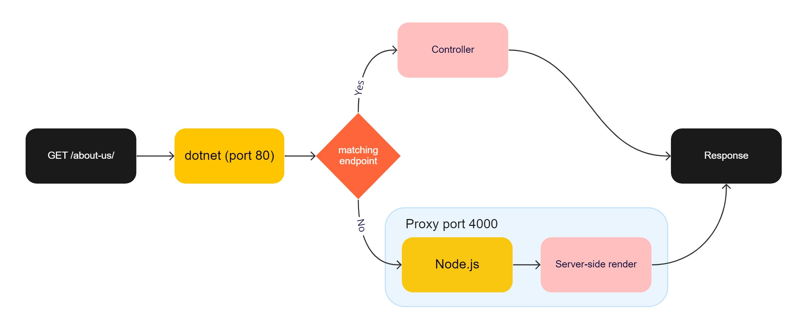

# Optimizely Content Delivery - Coupled

This sample site demonstrates one approach to render Optimizely content with a JavaScript framework with server-side rendering, client side routing, working On-Page Edit (OPE) mode, and where the client app and backend are hosted in the same application. The client app is hosted in its own Noje.js process and then proxied by dotnet. [See below for a more details](#architecture).

This sample uses [Nuxt 3](https://v3.nuxtjs.org/) (the Vue.js equivalent to React's Next.js), but most of the techniques are framework agnostic and can be used with any other framework, such as React or Angular.

Content is fetched from Optimizely using the Content Delivery API: https://world.optimizely.com/documentation/developer-guides/cms/content/content-delivery-api/

## Prerequisites

This project uses:
* Node.js 18+
* .NET SDK 6+
* SQL Server 2016 Express LocalDB ([download here](https://www.microsoft.com/en-us/sql-server/sql-server-downloads))

## Setup and Run

1. Run `setup.cmd` or `setup.sh` depending on your operating system. You can re-run the setup at any time to reset the backend with a fresh database.
2. Since we reference two NPM modules locally, we need to install them first. This step is not needed if you install the modules from npmjs.com instead.
    * Open terminal for `../../src/@episerver/content-definitions` and run `npm install` (only needed first run).
    * Open terminal for `../../src/@episerver/content-delivery` and run `npm install` (only needed first run).
    * Open terminal for `ClientApp` and run `npm install`.
3. Open terminal and run `dotnet run`.
    * Navigate to http://localhost:8080.
    * Create an admin user.
    * The Node.js proxy will automatically start the client app and dotnet will serve it when it's ready.

## Architecture

### Backend

The backend is based on an [empty installation of Content Cloud](https://docs.developers.optimizely.com/content-cloud/v12.0.0-content-cloud/docs/installing-optimizely-net-5) with the [Delivery API](https://docs.developers.optimizely.com/content-cloud/v1.5.0-content-delivery-api/docs/quick-start) installed. Content types are defined with C# classes. What differs from a decoupled setup, is that the client app (Node.js) and backend (dotnet) are served on the same address by proxing requests from dotnet to the Node.js process.



In `startup.cs` a proxy is added by calling `services.AddNodeJs()` and by calling `app.UseEndpoints(e => e.MapNodeJs());` a fallback endpoint is registered to the Node.js process. This means if an incoming request doesn't match any other endpoint, for example a controller, the request will be proxied to the Node.js process. The Node.js process is managed automatically by the proxy, there's no need to start it manually.

> This means the application should always be started with `dotnet run`.

### Client app

In `app.vue`, default configuration for the Content Delivery API SDK is set up. Nuxt is a convention-based framework and routing is be based on file naming. The page component `/pages/[...path].vue` is a wildcard route and all requests that don't map any other page component or route will end up here. It's this component that will call the Content Delivery API and try to route the request to a content page from the backend. The routed content page is stored in the global state `/composables/useResolvedContent.ts` so it can be accessed from any other component.

The content page, if resolved successfully, is rendered by the `EPiServerPage` component, `/components/episerver/Page.vue`. This component will resolve the best matching component from the `/views/pages/` folder to render it. A similar component, `/compontents/episerver/Block.vue`, is used for rendering of content blocks. An example of this can be found in `/compontents/episerver/ContentArea.vue`, this component is used for rendering of content area properties.

### Enable on-page-edit

The on-page-edit overlay is based on data attributes that are rendered on the content properties' HTML elements. These attributes are only needed when the content is rendered inside Edit mode and this is done by a directive that is registered in `/plugins/epiEdit.ts`. Example usage: `<h1 v-epi-edit="'Title'">{{ model.Title }}</h1>`.

The routed content global state also needs to be updated when a content property has been updated. This is achieved by first embedding a "communication script", this is done in `/pages/[...path].vue`, and then by subscribing to 'content saved' events in `/plugins/updateOnContentSaved.ts`.

## Publishing and Hosting

In `MusicFestival.csproj` there is a target called `BuildClientApp`. This target is optional, but it makes publishing of the solution a bit more convenient. This target can be replaced by a separate build step in a CI/CD pipeline, if preferred. This means a regular `dotnet publish` will suffice.

To host this setup in DXP, follow the [regular deployment instructions](https://docs.developers.optimizely.com/digital-experience-platform/v1.2.0-dxp-cloud-services/docs/deploy-using-code-packages) and then enable Node.js with the [platform settings file](https://docs.developers.optimizely.com/digital-experience-platform/v1.2.0-dxp-cloud-services/docs/code-package-format#platform-settings-file):
```json
{
  "$schema": "https://schema.episerver.net/paasportal/2022-03-24/platformschema.json",
  "platformPackages": [
    {
      "name": "NodeJs",
      "version": 17
    }
  ]
}
```
